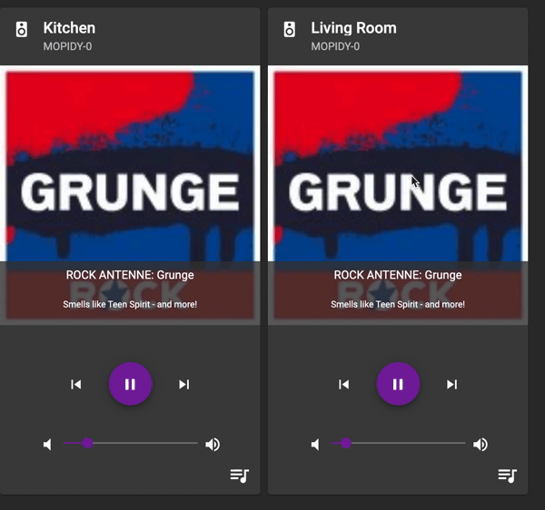
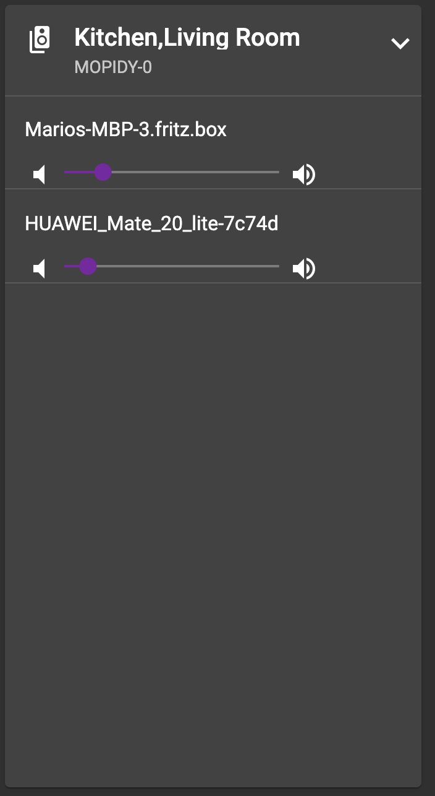
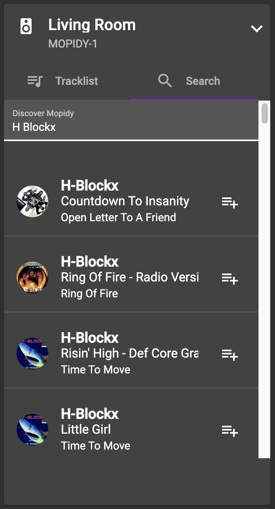

# About HydraPlay
HydraPlay is a multiroom audio server with web client which can control multiple Mopidy instances controlled by a Snapcast installation. Hydraplay consists of two
components. A server which is written in Python. The server generates all the needed configs and starts the [Mopidy](https://mopidy.com/) and [Snapcast](https://github.com/badaix/snapcast) instance(s).

HydraPlay was inspired by a project i have seen on [Youtube](https://www.youtube.com/watch?v=Lmr58F8gSs8&t=100s) by Ryan Detzel. 

*This project is still under development, some things might not work are unstable*

## Screenshots

<center>
<div float: center'>
  </img>
</div>


<div float: center'>
  </img>
  </img>
</div>
</center>


## Getting Started

The easiest way to get it running is by using docker. Just checkout the source code from GitHub and change into the folder. Be sure that you have docker and docker-compose installed. Build the docker image by calling:

```
docker-compose build
```

Make a copy of the file `hydraplay.example.json` and rename it to `hydraplay.private.json`. This file contains all needed configurations for the setup. 

Open the file in an editor and make your changes. If you want to enable Spotify you need a client_id and client_secret. Just follow the instructions of the [Mopidy Spotify extension](https://mopidy.com/ext/spotify/). Add the cliendId, client secret and your Spotify login credentials to the config. Enable Spotify and  save all changes.

Now you are able to start the server with:

```
docker-compose up
```

Connect your SnapClients to the server by running

```
snapclient -h <server_ip>
```

Open a Browser and goto:

```
http://<your_server_ip>:<port_in_configuration>
```


## Configuration
TODO

## Details 
You can find a [blog  post.](https://www.mariolukas.de/2019/07/hydraplay-open-source-multiroom-audio/) which i wrote a couple of years ago when i started the project. A lot of things changed since the first setup. But it will give you and idea on how it works under the hood.


### Known Issues
* mdns/avahi does not work within docker. You need to start your clients with  the -h <ip_address_of_server> parameter.
* Play/Pause button will not change back after a track was completed. Somehow there is no Mopidy event incomming for EndOfTrack.

### Not Implemented yet

- [ ] remove track from tracklist
- [ ] change tracklist order
- [ ] save tracklist as playlist
- [ ] load playlists
- [ ] add message wehn no client is connected (until now only a black screen appears)
- [ ] change client names

### Credits
This project would not have been possible without all the work on [Snapcast](https://github.com/badaix/snapcast) and [Mopidy](https://mopidy.com/)! Special thanks to Ryan Detzel for the inspiration.

### Donations

If you like my work and want to support it, feel free to leave a donation.

<center>
<a href="https://www.paypal.com/donate?hosted_button_id=FHPTBZ43KZGSU">
  
</a>
</center>


