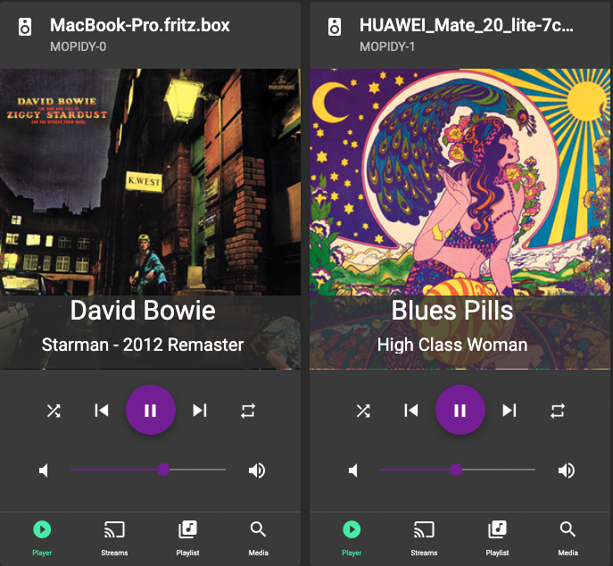
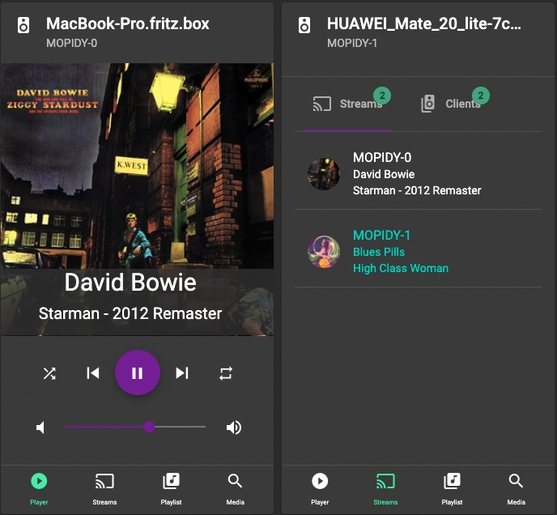
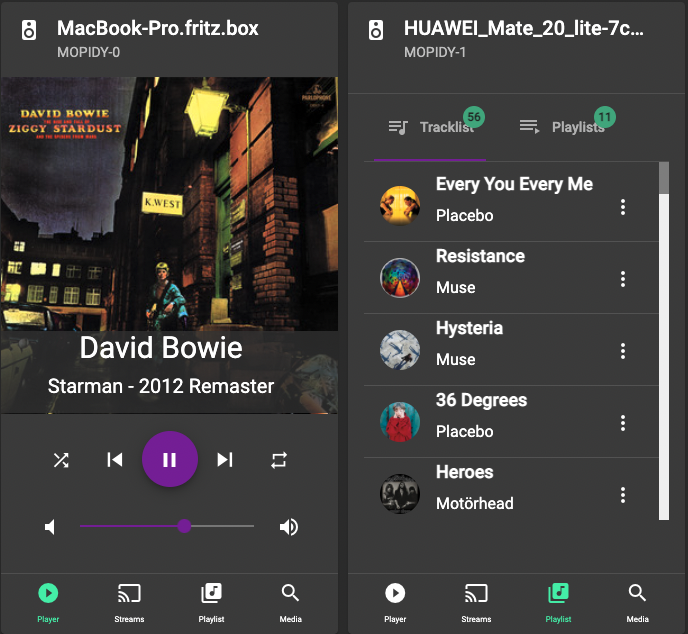
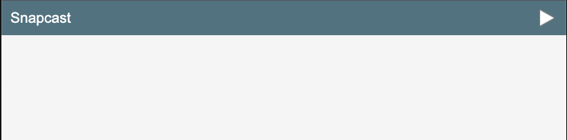
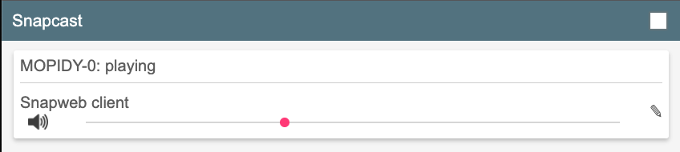

# About HydraPlay
HydraPlay is an easy to use multiroom audio player. HydraPlay provides an integrated web interface to multiple
[Mopidy](https://mopidy.com/) instances and one [Snapcast](https://github.com/badaix/snapcast) server. It generates
all the complex configurations under the hood. Only one configuration file is needed to define what the user needs.

The server part is written in Python and provides a webserver for the frontend delivery. Besides that the server 
generates all configurations and cares about starting Mopidies and Snapcast. 

The Frontend is written in TypeScript with the usage of Angular. It connects to the Mopidy and Snapcast web API's to
combine all the fancy functions in one user interface. 

HydraPlay was inspired by a project i have found on [Youtube](https://www.youtube.com/watch?v=Lmr58F8gSs8&t=100s) 
by Ryan Detzel.

*This project is still under development, some things might be unstable*


## Screenshots
The scnreenshots below show two connected players and a configuration with two (default value) Mopidy instances. 
<center>

### Player controls<br>
<div style="text-align: center">
  </img><br><br>
</div>

### Stream/Zone controls<br>
<div style="text-align: center">
  </img><br><br>
</div>

### Playlist controls<br>
<div style="text-align: center">
  </img><br><br>
</div>
</center>


## Getting Started

The following steps require Docker and Docker Compose to be installed on your system.

[Guide to install Docker](https://docs.docker.com/get-docker/)

[Guide for Docker Compose](https://docs.docker.com/compose/install/)

### 1. Configure Hydraplay

Make a copy of the file `hydra.example.json` and rename it to `hydra.private.json`. This file contains all needed configurations for the setup. 

Open the file in an editor and make your changes. If you want to enable Spotify you need a client_id and client_secret. Just follow the instructions of the [Mopidy Spotify extension](https://mopidy.com/ext/spotify/). Add the cliendId, client secret and your Spotify login credentials to the config. Enable Spotify and  save all changes.

### 2. Start the Docker container 

Now you are able to start the server with:

:warning: **Using this on a Mac with Apple silicon requires [Rosetta](https://docs.docker.com/desktop/mac/apple-silicon/), additionally you need to enable ```platform: linux/amd64``` in the docker-compose.yml file.**

```
docker-compose up
```

### 3. Connect a SnapClient to HydraPlay

Connect a SnapClient to the server.

#### Integrated Webclient (Snapweb)
The fastest way is by using the integrated webclient. Open a browser and go to 

```
http://<your_server_ip>:<port_in_configuration>/client/
```
Click on the play button on the top right corner in the window.
<div style="text-align: center">
  </img><br><br>
</div>

Your client should be connected to the server ( you can proceed with the next step)

<div style="text-align: center">
  </img><br><br>
</div>

#### Connect with SnapClient

Alternatively use a more stable generic client on your client-side systems (e.g Raspberry Pi)

```
snapclient -h <server_ip>
```

Detailed information can be found on the offical [Snapcast GitHub project](https://github.com/badaix/snapcast) documentation.

#### Use SnapCasts Android Client

Or even install the official android client on your mobile phone

[https://github.com/badaix/snapdroid/releases/tag/v0.24.0](https://github.com/badaix/snapdroid/releases/tag/v0.24.0)

### 4. Open HydraPlay and use it!

Finally open a Browser and goto:

```
http://<your_server_ip>:<port_in_configuration>
```

## Donations

If you like my work and want to support it, feel free to leave a donation.

<center>
<a href="https://www.paypal.com/donate?hosted_button_id=FHPTBZ43KZGSU">
  
</a>
</center>


## Configuration
This section describes the HydraPlay cofiguration file ```hydra.example.conf```

### Hydraplay Section

**port**: defines the web port on which hydraplay will be available in the browser. Defaults is ```8080```

**source_type**: Defines which type of audio source should be used between mopidy and snapcast. Possible values are ```fifo``` and ```tcp```. Defaults is ```tcp```.
### Snapcast Section

**config_path**:  Defines the path to the generated Snapserver config file. Default for Docker usage is ```/tmp/```,

**server_port**: Default is ```1704```

**remote_port**: Default is ```1705```

**additional_fifos**: Will be used for additional sources but is not implemented yet. Default is ```[]```,

**codec**: Defines Snapcsats audio codec. Possible values are ```flac, opus, ogg, pcm``` Default is ```flac```

### Mopidy Section

**mpd_base_port**: Default is ```6600```

**web_base_port**: Defines the web API port for Mopidy. This port is used by HydraPlay for connecting to the Mopidy web API. The first instance equals to this port. For all further instances the port is increased by a count of one. Default is```6680```

**instances**: Defines the number of stated Mopidy instances. Each instance represents one stream in HydraPlay. A good
starting point would be number of instances equals number of clients. Defualt is ```2```

**config_path**: Defines the folder where HydraPlay generates the Mopidy configurations. Default is ```/tmp/```,

#### Extensions
TODO

## Development

### Running a dev container locally
If you want to do some development on the ui you can use a local docker dev 
image for keeping things easy. The dev image is almost the same as the production image but it does not contain a pre-compiled version of the ui. Therefore the image build process is much faster. Just run 

```docker-compose -f docker-compose.dev.yml build```

:warning: **Using this on a Mac with Apple silicon requires [Rosetta](https://docs.docker.com/desktop/mac/apple-silicon/), additionally you need to enable ```platform: linux/amd64``` in the docker-compose.yml file.**


Afterwards you can fire up the development environment
by 

```docker-compose -f docker-compse.dev.yml up```

Now you can proceed whit "Build the Angular Frontend"

### Build the Angular Frontend
[nodejs](https://nodejs.org/en/download/) is required before you can proceed.
After you've installed nodejs you can build the ui by using: 

```
cd src/ui
npm install -g @angular/cli -g
npm install
ng build
```

You can run ```ng build``` with the additional argument ```--watch``` for live
re-compiling while you are working on your code. 

The build folder is located at ```/src/hydraplay/server/static/player```


### Building the production image. 
You can build a production image instead downloading by using:

docker build -f docker/Dockerfile -t mariolukas/hydraplay --build-arg SNAPCASTVERSION=0.26.0 .

:warning: **Using this on a Mac with Apple silicon requires [Rosetta](https://docs.docker.com/desktop/mac/apple-silicon/), additionally you need to enable ```platform: linux/amd64``` in the docker-compose.yml file.**

## Details 
You can find a [blog  post.](https://www.mariolukas.de/2019/07/hydraplay-open-source-multiroom-audio/) which i wrote a couple of years ago when i started the project. A lot of things changed since the first setup. But it will give you and idea on how it works under the hood.
( the blog post describes the very first prototype! )

### Known Issues
* mdns/avahi does not work within docker. You need to start your clients with  the -h <ip_address_of_server> parameter.
* ~~Play/Pause button will not change back after a track was completed. Somehow there is no Mopidy event incomming for EndOfTrack.~~ (works with tcp sources)

### Not Implemented yet

- [ ] add debian package config and make file
- [ ] add build script for raspberry pi image
- [ ] add more documentation ( for Raspberry Pi, MacOS with m1, run without docker, configuration etc. )
- [x] provide ready to use pre-build docker images 

### Credits
This project would not have been possible without all the work on [Snapcast](https://github.com/badaix/snapcast) and [Mopidy](https://mopidy.com/)! Special thanks to Ryan Detzel for the inspiration.

### Community and Support 

[Join](https://discord.gg/xs9CKfbpuY) us at Discord (https://discord.gg/xs9CKfbpuY).


