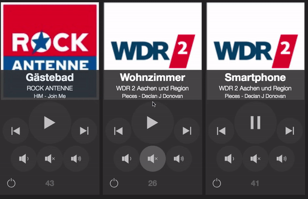
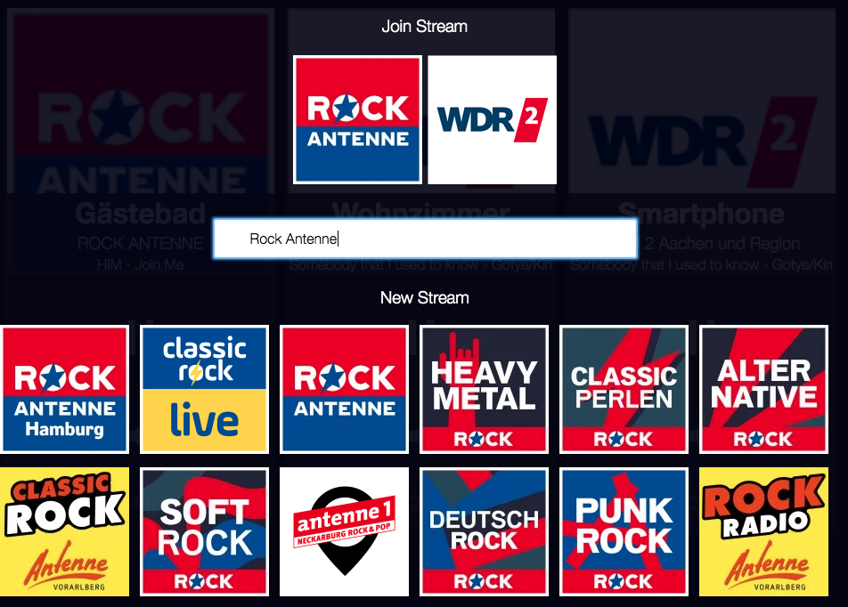
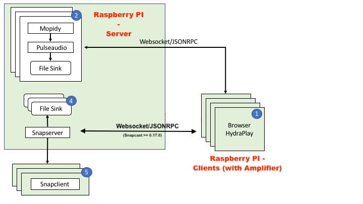

# HydraPlay
HydraPlay is a multiroom audio player which can control multiple mopidy instances controlled by a snapcast installation.
This project was generated with [Angular CLI](https://github.com/angular/angular-cli) version 7.3.6.

The project is inspired by a project i have seen on [Youtube](https://www.youtube.com/watch?v=Lmr58F8gSs8&t=100s)
I found some of the Authors (Ryan Detzel) code on [GitLab](https://gitlab.com/ryandetzel/music-all/tree/master/src).
I used the html and css parts of the original code form the project. The rest of the code is new. It is Angular and 
TypeScript based.

<center>

<div float: center'>
  </img>
</div>

<div float: center'>
  </img>
</div>

</center>

I decided to use JSONRPC as protocl, cause both mopidy and snapcast speak JSONRPC by default.
The original project used some MQTT parts. But i never figured out how the snapcast communication
was established.

The general setup (in my case) consists of:

Hardware: 
- 1 Raspberry Pi as [SnapCast Server](https://github.com/badaix/snapcast)
- N Raspberry Pi as [SnapCast Client](https://github.com/badaix/snapcast)

Software on Server: 
- Pulseaudio
- Snapcast Server
- N Mopidy instances
- Websockify

[SnapProxy](https://github.com/mariolukas/SnapProxy) is a small proxy server written by my own to connect to snapcast server
API over websockets and http requests. Cause the [snapcast API](https://github.com/badaix/snapcast/tree/master/doc/json_rpc_api) speaks over raw TCP/IP
sockets only by now.

Software on Clients: 
- Snapcast Client

 
A simple configuration of the whole system will follow soon... (maybe also a docker container for the sever setup)

## How the setup works

<div float: center'>
  </img>
</div>


## Getting started

### Server Setup

The following guide assumes that you have a Raspberry Pi 3 with a fresh installation of Raspbian. 

#### Installing Snapserver

Downlaod the latest Snapcast Server Package from GitHub. 
  
 ```$ wget https://github.com/badaix/snapcast/releases/download/v0.15.0/snapserver_0.15.0_armhf.deb ```
  
Install the Package and it dependencies. 

 ```$ sudo dpkg -i snapclient_0.15.0_armhf.deb ```
 
 ```$ sudo apt-get -f install```

Configuration of Snapcast server for the streams. In this case we will have 3 Mopidiy instances. If you need more streams, simply add them. Open the Snapserver configuraiton with 

 ``` $ sudo nano /etc/default/snapserver```
  
and modify the sollowing line 

  ```SNAPSERVER_OPTS="-d -s pipe:///tmp/mopidy2.fifo?name=mopidy2&mode=create -s pipe:///tmp/mopidy1.fifo?name=mopidy1&mode=create"```

Afterwards restart Snapserver. Snapserver is now configured and ready. Additionally you can add it so systemd auto start.

#### Installing Pulseaudio

Install the Pulseaudio package by 

  ```$ sudo apt-get install pulseaudio```

.. furhter steps folliwing soon ... 

  
## Development server

Run `ng serve` for a dev server. Navigate to `http://localhost:4200/`. The app will automatically reload if you change any of the source files.

## Code scaffolding

Run `ng generate component component-name` to generate a new component. You can also use `ng generate directive|pipe|service|class|guard|interface|enum|module`.

## Build

Run `ng build` to build the project. The build artifacts will be stored in the `dist/` directory. Use the `--prod` flag for a production build.

## Running unit tests

Run `ng test` to execute the unit tests via [Karma](https://karma-runner.github.io).

## Running end-to-end tests

Run `ng e2e` to execute the end-to-end tests via [Protractor](http://www.protractortest.org/).

## Further help

To get more help on the Angular CLI use `ng help` or go check out the [Angular CLI README](https://github.com/angular/angular-cli/blob/master/README.md).

## Credits
- Ryan Detzel ( For inspireing the project and his work on css and html on GitLab)
